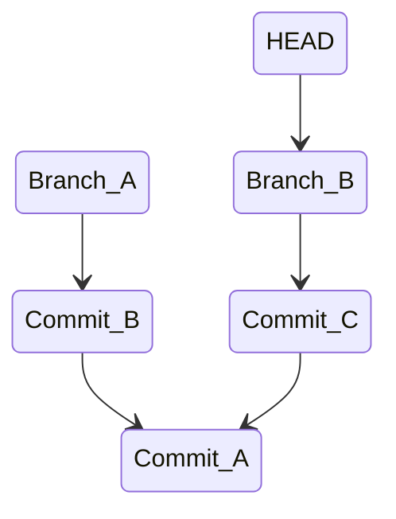
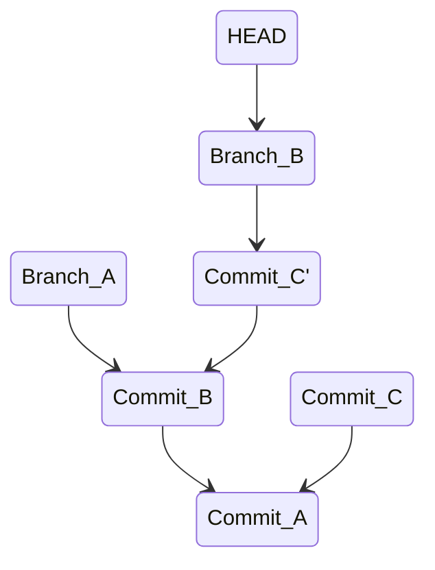

# Combining Branches

As a git tree becomes more complex, you might find that you want to
combine changes that have branched out from one another.

For the following examples, it's easiest to start with a new git repository.
If you're working in an example repo and don't care about the files, then simply remove the `.git` folder and delete all of the files.
Each example has steps to create the desired tree.

## Merge

This example is designed to not have conflicts when we merge the branches.
This is the expected state before we run `git merge`.



```bash
git switch -c branch-a

touch a.txt
touch b.txt
git add .
git commit -m "commit a"

echo abcd > a.txt
git commit -am "commit b"

git switch -c branch-b
git reset --hard HEAD~

echo 1234 > b.txt
git commit -am "commit c"
```

We are on `branch-b` but we might want the change that is on `branch-a`. So let's merge.

```bash
# opens the editor for the merge commit message
git merge branch-a

# feel free to save the prepopulated commit message

# You should see "merge: <sha1> <sha2>" as part of the commit message
git log -1

# you now have the changes in "commit b" and "commit c" without having mutated either commit
```

## Merge Conflicts

This setup is very similar to the previous example, but you'll get a conflict when merging.
This is the expected state before we run `git merge`.


```bash
git switch -c branch-a

touch a.txt
touch b.txt
git add .
git commit -m "commit a"

echo abcd > a.txt
echo 1234 > b.txt
git commit -am "commit b"

git switch -c branch-b
git reset --hard HEAD~

echo efgh > a.txt
git commit -am "commit c"
```

We are on `branch-b` and we want the changes to `b.txt` from `branch-a`. When we merge `branch-a` we will get a conflict because `a.txt` was touched by commits in both branches.

```bash
# Conflict
git merge branch-a
```

Right now, your working directory might seem like it's in a weird state,
however it is pretty much the same as when you're normally working.
You can stage and unstage files the same way.
The major difference is that some files are marked as having conflicts, and `git` is
aware that you are in the middle of a merge, so it's expecting you to make a commit or abandon the merge.

**note**: You can always run `git merge --abort` to abandon the merge commit.

```bash
# You should see "Unmerged paths" with the file that has a conflict
git status

# Open "a.txt" in an editor
# You will see that git has added text to mark the conflict
# git is a program for tracking changes to text files
# git does not care if you commit the text that it added
# it is up to you to put "a.txt" in the state that you want it in

# make sure to save "a.txt" when you're done!

git add a.txt

# before you commit, you can always unstage a.txt, modify it, delete it, whatever

# opens a text editor
git commit
```

## Rebase

Rebasing is useful for combining commits from different branches without having
to make additional commits. A `merge` operation creates an additional merge commit, where a rebase does not.

Take the following example.


Rebasing `branch-b` onto `branch-a` will have the following effect. Note that `branch-b` tree has `Commit_C'` because commits are immutable. The original `Commit_C` was orphaned, and a new commit was created. `Commit_C` and `Commit_C'` will have different commit ids, but the same changes. After rebasing, `branch-b` will be ahead of `branch-a` by one commit.



Here is the above example.

```bash
git switch -c branch-a

touch a.txt
touch b.txt
git add .
git commit -m "commit a"

echo abcd > a.txt
git commit -am "commit b"

git switch -c branch-b
git reset --hard HEAD~

echo 1234 > b.txt
git commit -am "commit c"
```

Now for the rebase.

```bash
git rebase branch-a
```

## Rebase Conflicts

```bash
git switch -c branch-a

touch a.txt
git add .
git commit -m "commit a"

echo abcd > a.txt
git commit -am "commit b"

git switch -c branch-b
git reset --hard HEAD~

echo defg > a.txt
git commit -am "commit c"

# Conflict!
git rebase branch-a
```

This situation is slightly different than a `merge` conflict.
You can stage and unstage changes like normal, but `git` does not expect you to make
a commit.

Additionally when you view the conflict the concept of "current change" and "incoming change" are slightly different than a `merge`. Since `branch-b` is being rebased onto `branch-a`, `branch-b`'s commits are the incoming change.

Once your conflicts are resolved you're expected to run `git rebase --continue`

```bash
# fix a.txt and save your changes!

git add .

git rebase --continue
```
