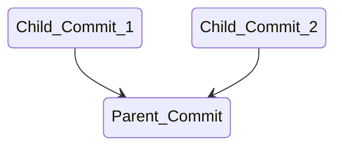

# Creating and Updating Commits

A commit is a bundle of information. It contains an id, one or more parent ids, a message, supplemental data (like a timestamp) and one or more files.

Any changes added to a commit will bundle the entire file, [not just a diff](https://git-scm.com/book/en/v2/Getting-Started-What-is-Git%3F) of what has changed.

Commits are immutable! Once created, they cannot be changed, but you can create new commits to replace unwanted commits.

## Creating a Commit

```bash
touch a.txt

# shows a.txt as untracked
git status

git add a.txt

# shows a.txt as staged
git status

# opens your configured text editor
git commit

# type a message and close the file in your editor

# shows nothing
git status

# shows the newly created commit
git log -1
```

## "Updating" a Commit Message

```bash
# opens an editor
git commit --amend

# update the commit message in the editor

# shows the updated commit message
git log -1
```

**Note:** Ammending a commit actually creates a new commit. To verify this you can do:

```bash
# shows a history of git operations
# you should see two commit ids: one with the old message, and one with the new message
git reflog
```

## Aborting Updating a Commit Message

```bash
# opens an editor
git commit --amend

# read the pre-populated message in the editor to learn how to abort a commit
```

## Creating a Commit in a Single Command

```bash
touch b.txt

git add b.txt

git commit -m "your message goes here"
```

## Creating a Tree of Commits

Since commits have parents, if multiple commits are created off of the same parent then the git history becomes a tree of commits.
This happens as multiple developers work off of the same root commit. They create different branches of the tree that need to be managed.

Note that the arrows point from the children to the parent.
Given any commit, you can easily find it's history by following the parent commit(s).



```bash
touch d.txt

git add .

git commit -m "this is the parent commit"

touch e.txt

git add .

git commit -m "this is the first child commit"

# Note the commit id of your child commit: let's call it ID_1
git log -1

git commit --amend -m "this is a different child commit"

# Note the commit id of your child commit: let's call it ID_2
git log -1

# Shows the parent and first child commit
git log -2 <ID_1>

# Shows the parent and second child commit
git log -2 <ID_2>
```
