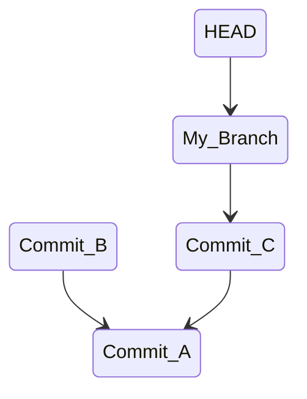

# Visualizing the Tree

A git repository is a tree of **immutable** commits.
As long as you know the commit id, the id of a future commit or you have a branch whose history contains the commit, then you will have access to the commit.

## Orphaned Commits

The following example diagram shows that "Commit B" has been orphaned.
It is not part of any branch history, and we may not know the commit id.
If this scenario ever happens, you can use several tools to find the lost id.



## Git Reflog

The git reference log shows the history of git operations in a repository.
It can be useful for finding the commit ids of orphaned commits.

## Git Log

Git log is a powerful tool for viewing history starting from any commit.
There are a lot of references on the internet for creating a tree-like diagram using `git log`.

## Other Tools

One of the limitations of `git log` is that it's a text based tool.
Git trees can be complex, so having a GUI to visualize the tree can be very useful.

A few examples include:

- [gitk](https://git-scm.com/docs/gitk/)
- [sourcetree](https://www.sourcetreeapp.com/)
- [git graph](https://marketplace.visualstudio.com/items?itemName=mhutchie.git-graph)

Find the tool that is right for you.

## Commit References

```bash
git switch -c bacon

echo three > a.txt
git add .
git commit -m "first commit"

echo blind >> a.txt
git commit -am "second commit"

echo mice >> a.txt
git commit -am "third commit"

# note the commit ids: Let's call them ID_1 ID_2 ID_3
git log -3

# shows "second commit" commit information
git log -1 <ID_2>

# shows "third commit" and "second commit"
# this uses a commit range
# notice that the commit range includes "first commit", but it is not shown
git log <ID_1>..<ID_2>

# shows "second commit"
# "~" means the parent of the reference
git log -1 HEAD~

# shows "second commit"
git log -1 bacon~

# shows "first commit"
git log -1 <ID_2>~
```
